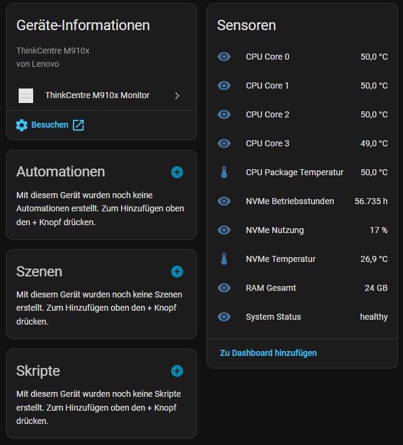
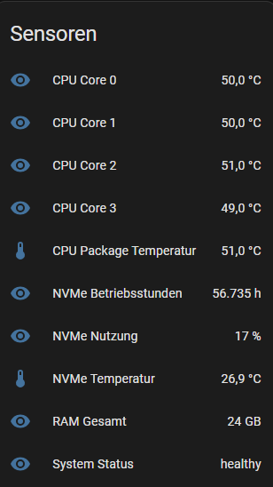

# HA PM ThinkCentre M910x

## 📡 What this integration does

Monitor für Lenovo ThinkCentre M910x PCs über Home Assistant.  
Die Integration liefert CPU-, RAM-, NVMe- und System-Health-Daten über eine Proxmox Sensor API.

---

## 📸 Overview

---

## ✨ Features

- CPU Temperaturen (Package + Cores)
- NVMe Temperatur & Nutzung
- NVMe SMART Daten
- RAM Übersicht
- System Health Status
- Automatische Aktualisierung via Coordinator

---

## ⚠️ Requirements (Proxmox Setup)

Damit die Integration funktioniert, müssen auf dem Proxmox-Host die Sensoren aus folgendem Projekt installiert sein:

👉 https://github.com/Javisen/proxmox_sensors

Installationsanleitung:
👉 https://github.com/Javisen/proxmox_sensors/blob/main/docs/de/01-install-sensors.md

---

## 🌐 API Endpoints

Die Integration nutzt folgende Endpoints:

- `http://DEINE_PROXMOX_IP:9000/sensors`
- `http://DEINE_PROXMOX_IP:9000/smart`
- `http://DEINE_PROXMOX_IP:9000/smart-extended`
- `http://DEINE_PROXMOX_IP:9000/memory`
- `http://DEINE_PROXMOX_IP:9000/health`
- `http://DEINE_PROXMOX_IP:9000/mounts`

---

## ⚙️ Installation (HACS)

1. Öffne **HACS → Integrationen**
2. Klicke auf **"+"**
3. Füge Repository hinzu:  
   `https://github.com/BerndeDGF/ha-pm-thinkcentre-m910x`
4. Installieren
5. Home Assistant neu starten

---

## 🔧 Configuration

1. Gehe zu **Einstellungen → Geräte & Dienste**
2. Klicke auf **Integration hinzufügen**
3. Wähle **HA PM ThinkCentre M910x**
4. Gib ein:

- **Name**
- **URL** (z. B. `http://192.168.2.16:9000`)
- **Scan Interval (10–300s)**

---

## 📊 Example Sensors

---

## 🧠 Supported Entities

- CPU Temperature (Package & Cores)
- NVMe Temperature & Usage
- NVMe Power-on Hours
- RAM Total
- System Status

---

## 📦 Requirements

- Home Assistant 2026.05.1+
- HACS
- Proxmox sensor API (external script)

---

## 💡 Notes

Die Integration ist optimiert für lokale Netzwerke und nutzt Polling über REST API.